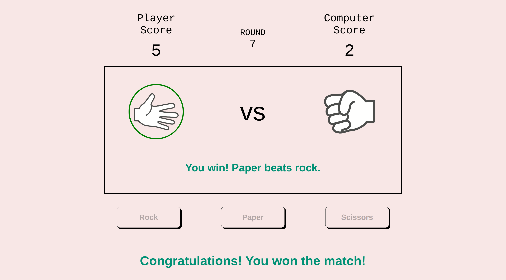

# Project: Rock Paper Scissors

## Project Preview

 

:link: A **live demo** of this project can be found
[here](https://potaytocheeps.github.io/rock-paper-scissors/). 

## Description

This is my implementation of the
[Rock Paper Scissors Project](https://www.theodinproject.com/lessons/foundations-revisiting-rock-paper-scissors)
from [**The Odin Project**](https://www.theodinproject.com/) curriculum in the JavaScript
Basics section of the Foundations course.

This is the third project in The Odin Project curriculum and the first that deals
with working with JavaScript by creating a simple implementation of the classic
Rock Paper Scissors game. The project began as a basic console implementation
of the game to practice the JavaScript skills learned thus far and to get all of
the necessary logic working to complete a full match of Rock Paper Scissors against
the computer.

I later revisited the project to add a Graphical User Interface in order to improve
the visuals and interactivity for the player. This project covers many of the
foundational concepts of JavaScript, such as working with variables, different
data types, and functions.

## Features

Play against the computer on a classic match of Rock Paper Scissors!

This simple project features the ability to make your selection of rock, paper, or
scissors by clicking on the **button** of your choice. Once having made a selection,
the computer will make its own selection, and the result of the round will be displayed
in the form of two **images** (one each for the selection of the player and the computer),
as well as a **message** detailing the results of the round.

Depending on your selection and that of the computer, you will either win, lose, or draw
the round. Whoever is the first to win 5 rounds will be the winner of the match!

## Concepts Applied

- This project makes use of **functions** to play each round, to compare the players' selections,
  and to display the result of each round.
- **Selectors** are used to access and modify the content of the DOM elements necessary
  for the game to function.
- **Classes** are added to and removed from some DOM elements in order to change their
  color to signify a win, loss, or draw, which allows for a better user experience overall.
- Additionally, an **event listener** is used in order for the round to begin whenever
  the player clicks on the button of their selection.

## Reflection

A short blog post containing some of my thoughts on the project can be found
[here](https://potayto.notion.site/Project-Rock-Paper-Scissors-c06568cf5f0f491a92d8922144b516b6).
